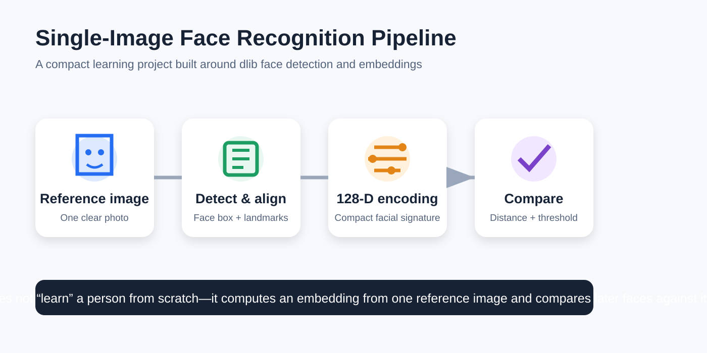
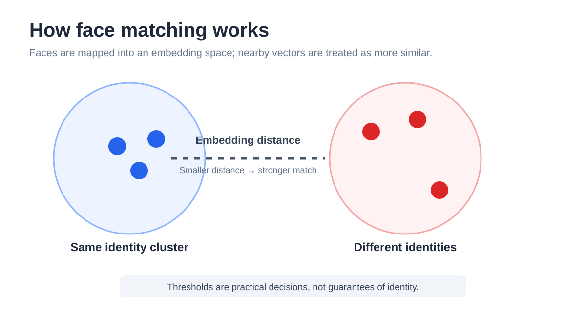
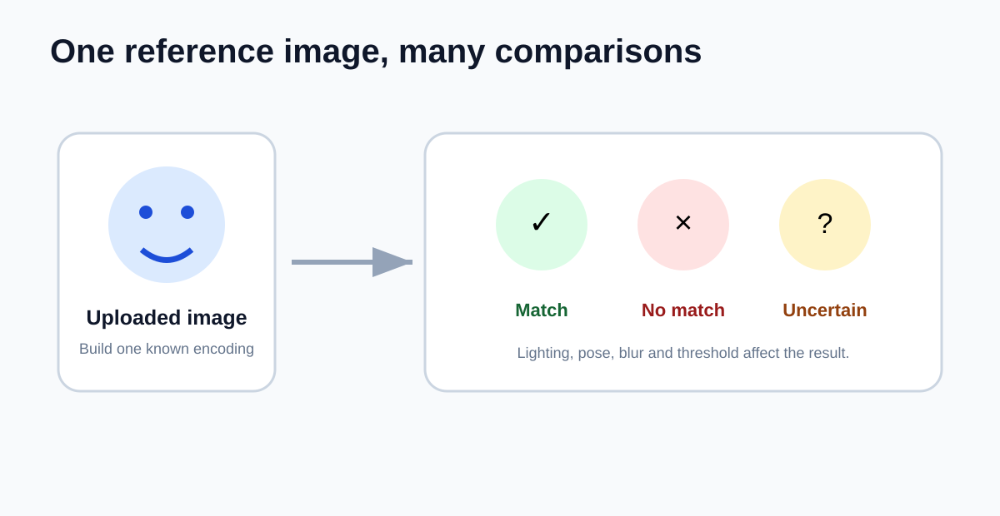

# Facial Recognition with a Single Reference Image

<p align="center">
  
</p>

A small, fun computer-vision project that explores how **dlib-based facial recognition** can identify a person from only one uploaded reference image.

The idea is intentionally simple: provide one clear image of a person, convert the detected face into a compact numerical representation, and compare that representation with faces found in another image or camera frame. The project was built as a learning experiment rather than a production identity system.

## What the project demonstrates

This repository demonstrates the core mechanics behind a practical facial-recognition workflow:

- accepting a single image as the known identity reference;
- locating the face in that image;
- aligning the face using facial landmarks;
- generating a numerical face embedding;
- detecting faces in a new image or frame;
- comparing embeddings using distance and a matching threshold;
- returning a match or unknown result.

The interesting part is that the application does not need a large custom training dataset for every person. A pretrained dlib recognition model produces a reusable facial encoding from the uploaded reference image. Later faces can then be compared directly against that encoding.

## Why this was built

Facial recognition often appears much more mysterious than it is. This project was created to understand the full inference pipeline in a small and approachable form: image loading, face detection, landmarks, feature extraction, vector comparison and a final decision.

It is best understood as a **portfolio and learning prototype** that shows how a modern pretrained model can support one-shot-style recognition from a single reference photograph.

## How the recognition pipeline works

### 1. Face detection

The first stage finds the face region inside the uploaded image. A dlib workflow commonly uses its frontal-face detector, which is based on Histogram of Oriented Gradients, an image pyramid, a sliding window and a linear classifier.

### 2. Landmark estimation and alignment

After the face is located, facial landmarks identify stable points around the eyes, eyebrows, nose, mouth and jaw. These points help normalize pose and crop the face consistently before feature extraction.

### 3. Face embedding

The aligned face is passed through dlib's deep face-recognition network. The model converts the face into a fixed-length numerical embedding, commonly represented as 128 values. This embedding is not a photograph and is not a human-readable identity record; it is a compact feature vector designed for similarity comparison.

### 4. Distance comparison

The reference embedding is compared with embeddings from newly detected faces. A smaller distance means the feature vectors are closer and therefore more likely to represent the same person. A threshold converts that continuous distance into a practical match or no-match decision.

<p align="center">
  
</p>

## The single-image idea

Only one reference photograph is required to create the known encoding. This makes the project quick to test and visually impressive, but it also introduces limitations. A single image cannot fully represent changes in lighting, expression, camera angle, age, occlusion or image quality.

<p align="center">
  
</p>

For a learning project, this tradeoff is part of what makes the experiment useful: it clearly shows both the power and the limitations of pretrained face embeddings.

## Technology

**Python** coordinates image loading, inference and result handling.

**dlib** provides the computer-vision and machine-learning components used for face detection, landmark prediction and deep face embeddings.

Depending on the exact implementation in this repository, image handling or display may also be supported by libraries such as NumPy, Pillow or OpenCV.

## Conceptual code flow

```text
Reference image
    ↓
Detect the face
    ↓
Align facial landmarks
    ↓
Generate the known face encoding
    ↓
Load a target image or frame
    ↓
Detect and encode every visible face
    ↓
Compare each encoding with the known encoding
    ↓
Match / Unknown
```

## Project character

This was a cool, compact learning project focused on understanding how facial-recognition systems work rather than building a large application around them. Its value is in the complete idea: one image becomes a reusable reference, and a pretrained deep model makes meaningful comparisons possible with very little input data.

## Important limitations

Face recognition is probabilistic. A match result is not proof of identity. Accuracy can change with pose, illumination, blur, occlusion, camera quality, age and the chosen distance threshold. Performance may also vary across demographic groups and age ranges.

This project should not be used for surveillance, law enforcement, access control, employment screening or any high-stakes decision. Use only images that you are authorized to process and follow applicable privacy and biometric-data laws.

## Repository assets

```text
assets/
├── face-recognition-pipeline.svg   # End-to-end project concept
├── embedding-distance.svg          # Similarity and threshold visualization
└── one-shot-concept.svg            # Single-reference-image explanation
```

## Author

**Yash Vyas**

For questions, collaboration or ideas related to the project, contact **yashvyas.ofcl@gmail.com**.

## References

- [dlib](https://github.com/davisking/dlib)
- [dlib face landmark detection example](https://github.com/davisking/dlib/blob/master/python_examples/face_landmark_detection.py)
- [dlib pretrained face-recognition model notes](https://github.com/davisking/dlib-models)
- [face_recognition Python library](https://github.com/ageitgey/face_recognition)

---

> This repository is an educational prototype. It is not an authentication product or a certified biometric identity system.
